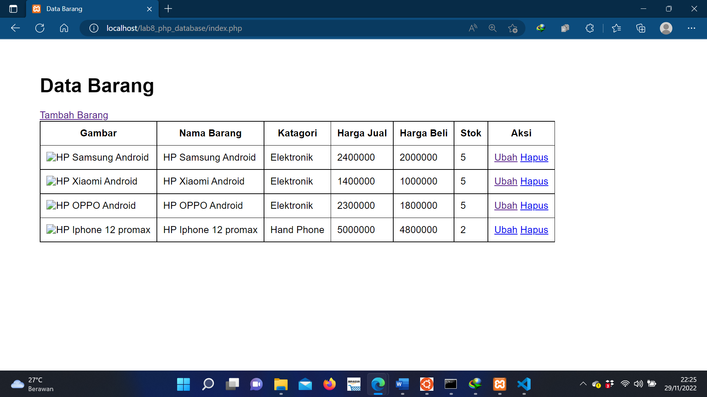

# Lab8Web

### Menjalankan MySQL Server
Untuk menjalankan MySQL Server dari menu XAMPP Contol.

### Membuat Database
CREATE DATABASE latihan1;

### Membuat Tabel

### Menambahkan Data

kemudian lihat hasilnya

### Membuat Program CRUD
Buat folder lab8_php_database pada root directory web server (c:\xampp\htdocs), Kemudian untuk mengakses direktory tersebut pada web server dengan mengakses URL: 
http://localhost/lab8_php_database/

### Membuat file koneksi database
Buat file baru dengan nama koneksi.php

### Membuat file index untuk menampilkan data (Read)
Buat file baru dengan nama index.php

### Menambah Data (Create)
Buat file baru dengan nama tambah.php

### Mengubah Data (Update)
Buat file baru dengan nama ubah.php

